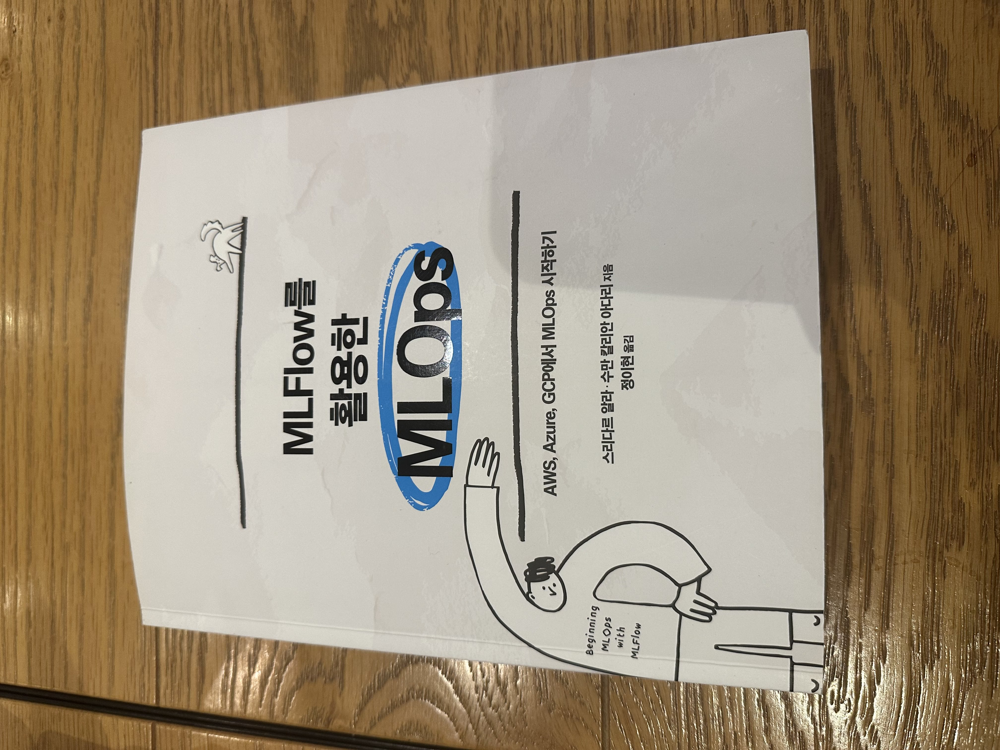

# MLOps_with_MLFlow
### MLFlow를 활용한 MLOps 책 코드 정리  
- [Scikit-Learn을 사용한 MLFlow 실습](https://github.com/workdd/MLOps_with_MLFlow/blob/main/scikit_learn_with_mlflow.ipynb)
- [Tensorflow를 사용한 MLFlow 실습](https://github.com/workdd/MLOps_with_MLFlow/blob/main/tensorflow_with_mlflow.ipynb)

